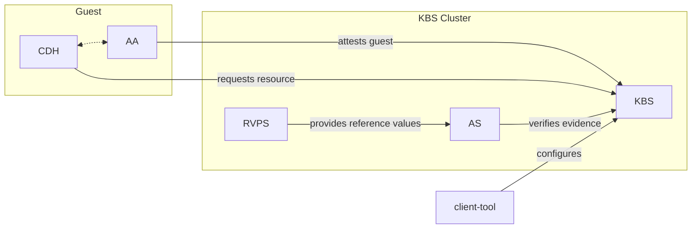

# Trusted Components for Attestation and Secret Management

This repository contains tools and components for attesting confidential guests and providing secrets to them.
These components typically operate on behalf of the guest owner and interact remotely with
[guest components](https://github.com/confidential-containers/guest-components).

These components were developed for the Confidential Containers project, but can be used with a wide variety
of applications and hardware platforms.

## Components

- [Key Broker Service](kbs)
The KBS is a server that facilitates remote attestation and secret delivery.
Its role is similar to that of the [Relying Party](https://www.ietf.org/archive/id/draft-ietf-rats-architecture-22.html#name-relying-party)
in the RATS model.

- [Attestation Service](attestation-service)
The AS verifies TEE evidence.
In the RATS model this is a [Verifier](https://www.ietf.org/archive/id/draft-ietf-rats-architecture-22.html#name-verifier)

- [Reference Value Provider Service](attestation-service/rvps)
The RVPS manages reference values used to verify TEE evidence.
This is related to the discussion in [section 7.5](https://www.ietf.org/archive/id/draft-ietf-rats-architecture-22.html#name-endorser-reference-value-pr)
of the RATS document.

- [Client Tool](kbs/tools/client)
This is a simple tool which can be used to test or configure the KBS and AS.

For further information, see documentation of individual components.

## Architecture

These components are flexible and can be deployed in several different configurations.
This figure shows one common way to deploy these components in conjunction with certain guest components.

## Deployment

There are two main ways to deploy the KBS and supporting components.

### Docker Compose

One simple way to get started with these components is with Docker compose, which can be used
to quickly setup a cluster matching the diagram above.

Please refer to the [cluster setup guide](kbs/docs/cluster.md).

This cluster could be run inside a VM or as part of a managed service.

### Kubernetes

There are two supported ways of deploying KBS on Kubernetes.
One is via the [KBS Operator](https://github.com/confidential-containers/kbs-operator),
which deploys the KBS components. The second option is to use the KBS'
provided Kubernetes tooling [here](kbs/config/kubernetes).

## License

