# Reference Value Provider Service

Reference Value Provider Service, RVPS for short is a componant to receive software supply chain provenances/metadata, verify them and extract the reference values.
All the reference values will be stored inside RVPS. When AS queries specific software claims, RVPS will response with related reference values.

## Architecture

RVPS contains the following componants:

- Pre-Processor : Pre-Processor contains a set of Wares (like Middleware). The Wares can process the input Message and then deliver it to the Extractors.

- Extractors : Extractors has sub-modules to process different type of provenance. Each sub-module will consume the input Message, and then generate an output Reference Value.

- Store : Store is a trait object, which can provide key-value like API. All verified reference values will be stored in the Store. When requested by Attestation Service, related reference value will be provided.

## Message Flow

The message flow of RVPS is like the following figure


### Message

A protocol helps to distribute provenance of binaries. It will be received and processed
by RVPS, then RVPS will generate Reference Value if working correctly. 

```
{
    "version": <VERSION-NUMBER-STRING>,
    "type": <TYPE-OF-THE-PROVENANCE-STRING>,
    "provenance": #provenance,
}
```

The `"version"` field is the version of this message, making extensibility possible.

The `"type"` field specifies the concrete type of the provenance the message carries.

The `"provenance"` field is the main content passed to RVPS. This field contains the payload to be decrypted by RVPS. 
The meaning of the provenance depends on the type and concrete Extractor which process this.

### Trust Digests

It is the reference values really requested and used by Attestation Service to compare with the gathered evidence generated from HW TEE. They are usually digests. To avoid ambiguity, they are named `trust digests` rather than `reference values`.

## Run RVPS

### Directly Build

In this way, the RVPS can run as a single service. The [gRPC protos](../protos/reference.proto) are defined.

We can run using the following command

```bash
cargo run --bin rvps --features="rvps-native rvps-grpc tokio/rt-multi-thread"
```

To by default listen to `localhost:50003` to wait for requests

### Container Image

We can build RVPS docker image

```bash
docker build -t rvps -f Dockerfile.rvps .
```

Run
```bash
docker run -d -p 50003:50003 rvps
```

## Integrate RVPS into AS

### Native Mode

In this way RVPS will work as a crate inside AS binary.

```bash
cargo run --bin grpc-as
```



### gRPC Mode

In this way AS will connect to a remote RVPS.

```bash
cargo run --bin grpc-as -- --rvps-address $RVPS_ADDR
```



## Client Tool

A client tool helps to perform as a client to rvps. It can
- Register reference values into the RVPS
- Query reference values from the RVPS

### Quick guide to interact with RVPS

Run RVPS
```bash
cargo run --bin rvps -- --socket $RVPS_ADDR
```

Edit an test message in [sample format](../attestation-service/src/rvps/extractors/extractor_modules/sample/README.md)
```bash
cat << EOF > sample
{
    "test-binary-1": [
        "reference-value-1",
        "reference-value-2"
    ],
    "test-binary-2": [
        "reference-value-3",
        "reference-value-4"
    ]
}
EOF
provenance=$(cat sample | base64 --wrap=0)
cat << EOF > message
{
    "version" : "0.1.0",
    "type": "sample",
    "payload": "$provenance"
}
EOF
```

Register the provenance into RVPS
```bash
cargo run --bin rvps-client -- register --path ./message --addr $RVPS_HTTP_ADDR
```

Then it will say something like
```
[2023-03-09T04:44:11Z INFO  rvps_client] Register provenance succeeded.
```

Let's then query the reference value
```bash
cargo run --bin rvps-client -- query --name test-binary-1 --addr $RVPS_HTTP_ADDR
```

Then the reference values will be output
```
[2023-03-09T05:13:50Z INFO  rvps_client] Get reference values succeeded:
     {"name":"test-binary-1","hash_values":["reference-value-1","reference-value-2"]}
```