# Reference Value Provider Service

Reference Value Provider Service, RVPS for short is a componant to receive software supply chain provenances/metadata, verify them and extract the reference values.
All the reference values will be stored inside RVPS. When AS queries specific software claims, RVPS will response with related reference values.

## Architecture

RVPS contains the following componants:

- Pre-Processor : Pre-Processor contains a set of Wares (like Middleware). The Wares can process the input Message and then deliver it to the Extractors.

- Extractors : Extractors has sub-modules to process different type of provenance. Each sub-module will consume the input Message, and then generate an output Reference Value.

- Store : Store is a trait object, which can provide key-value like API. All verified reference values will be stored in the Store. When requested by Attestation Service, related reference value will be provided.

## Message Flow

The message flow of RVPS is like the following figure


### Message

A protocol helps to distribute provenance of binaries. It will be received and processed
by RVPS, then RVPS will generate Reference Value if working correctly. 

```
{
    "version": <VERSION-NUMBER-STRING>,
    "type": <TYPE-OF-THE-PROVENANCE-STRING>,
    "provenance": #provenance,
}
```

The `"version"` field is the version of this message, making extensibility possible.

The `"type"` field specifies the concrete type of the provenance the message carries.

The `"provenance"` field is the main content passed to RVPS. This field contains the payload to be decrypted by RVPS. 
The meaning of the provenance depends on the type and concrete Extractor which process this.

### Trust Digests

It is the reference values really requested and used by Attestation Service to compare with the gathered evidence generated from HW TEE. They are usually digests. To avoid ambiguity, they are named `trust digests` rather than `reference values`.

## Run mode

### As a single binary

In this way, the RVPS can run as a single service. The [gRPC protos](../bin/rvps/proto/reference.proto) are defined. They are `registration of reference values` and `query of reference values`.

We can run using the following command

```bash
cargo run --bin rvps --features="rvps-server rvps-proxy tokio/rt-multi-thread"
```

To by default listen to `localhost:50003` to wait for requests

### Integrate RVPS into AS

We can also run Attestation Service as a submodule, s.t. integrate RVPS into AS.
As RVPS has relatively independent functions, we also provide two ways for AS to integrate RVPS.
- Server mode. Integrate the function of RVPS directly in AS. In this way, RVPS and AS will share the same process. Feature `rvps-server` needs to be enabled and `AS` object should be created by `new()` to imply that the inner RVPS is directly integrated. Server mode is like the figure.


- Proxy mode. Using a stub in AS to connect RVPS server. In this way, the AS itself does not have functions of RVPS. It connects a remote RVPS. Feature `rvps-proxy` needs to be enabled and `AS` object should be created by `new_with_rvps_proxy()` to use this way. Proxy mode is like the figure.


Both of the ways require AS to expose the `registration of reference values` API.
#### RVPS in AS binary

[Here](../bin/grpc-as/) gives an example of Attestation Service of gRPC-version.
In this example, we implements RVPS both server mode and proxy mode, which is determined by whether the `--rvps-address` parameter is given.

Run as server mode

```bash
cargo run --bin grpc-as --features="rvps-server rvps-proxy tokio/rt-multi-thread"
```

Run as proxy mode
```bash
cargo run --bin grpc-as --features="rvps-server rvps-proxy tokio/rt-multi-thread" -- --rvps-address $RVPS_ADDR
```

#### RVPS in KBS binary

As [KBS](https://github.com/confidential-containers/kbs) uses AS as a crate/submodule rather than a separate binary, we can integrate RVPS into KBS in two ways.

##### As a single binary (Recommended)

As RVPS would require expose `registration of reference values` API, a separate running RVPS is preferred, s.t. let AS crate run in proxy mode. The architecture will look like


##### Integrate inside KBS (Not Recommended)

In this way, the `registration of reference values` API should be exposed by KBS.
As this API should not be part of functionalities of KBS, we do not recommend this way.
The architecture will look like

