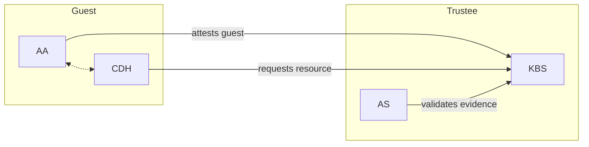
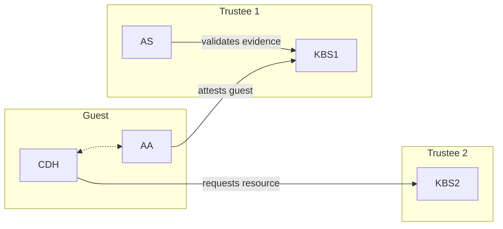

# Key Broker Service

The Confidential Containers Key Broker Service (KBS) facilitates remote attestation and secret delivery.
The KBS is an implementation of a [Relying Party](https://www.ietf.org/archive/id/draft-ietf-rats-architecture-22.html).
The KBS itself does not validate attestation evidence. Instead, it relies on the [Attestation-Service (AS)](https://github.com/confidential-containers/attestation-service) to verify TEE evidence.

In conjunction with the AS or Intel Trust Authority (ITA), the KBS supports the following TEEs:

- AMD SEV-SNP
- AMD SEV-SNP on Azure with vTPM
- Intel TDX on Azure with vTPM
- Intel TDX
- Intel SGX
- ARM CCA
- Hygon CSV

# Deployment Configurations

The KBS can be deployed in several different environments, including as part of a docker compose cluster, part of a Kubernetes cluster
or without any containerization. Additionally, the KBS can interact with other attestation components in different ways.
This section focuses on the different ways the KBS can interact with other components.

## Background Check Mode

Background check mode is the most common way to configure the KBS and AS.
The term [Background Check](https://www.ietf.org/archive/id/draft-ietf-rats-architecture-22.html#section-5.2) is from the RATS architecture.
In background check mode, the KBS releases secrets to a confidential guest after the attestation agent has validated the hardware evidence.


In background check mode, the KBS is the relying party and the AS is the verifier.

The background check configuration can be invoked using the Makefile.

Build and install KBS with native integrated AS in background check mode:
```shell
make background-check-kbs
make install-kbs
```

The Makefile has other optional parameters that are described below.

## Passport Mode

Passport mode decouples the provisioning of resources from the validation of evidence.
In background check mode these tasks are already handled by separate components,
but in passport mode they are decoupled even more.
The term [Passport](https://www.ietf.org/archive/id/draft-ietf-rats-architecture-22.html#section-5.1) is from the RATS architecture.

In passport mode, there are two KBSes, one that uses a KBS to verify the evidence and a second to provision resources.



In the RATS passport model the client typically connects directly to the verifier to get an attestation token (a passport).
In CoCo we do not support direct conections to the AS, so KBS1 serves as an intermediary.
Together KBS1 and the AS represent the verifier.
KBS2 is the relying party.

Passport mode is good for use cases when resource provisioning and attestation are handled by separate entities.

Passport mode can be enable via the Makefile.
You will need to build two KBSes to use passport mode.

Build and install KBS for issuing token (KBS1):
```shell
make passport-issuer-kbs [HTTPS_CRYPTO=?] [AS_TYPES=?] [COCO_AS_INTEGRATION_TYPE=?]
make install-issuer-kbs
```

See below for explanation of additional parameters.

Build and install KBS for distributing resources (KBS2):
```shell
make passport-resource-kbs [HTTPS_CRYPTO=?] [POLICY_ENGINE=?]
make install-resource-kbs
```

## Other Parameters

The Makefile supports a number of other configuration parameters.
For example,
```shell
make background-check-kbs [HTTPS_CRYPTO=?] [POLICY_ENGINE=?] [AS_TYPES=?] [COCO_AS_INTEGRATION_TYPE=?]
```

### HTTPS Support

The KBS can use HTTPS. This requires a crypto backend.
`HTTPS_CRYPTO` determines which backend will be used.
The options are `rustls` and `openssl`. The default is `rustls`.

If you want a self-signed cert for test cases, please refer to [the document](docs/self-signed-https.md).

### Policy Engine

The KBS has a policy engine to determine when a resource should be released.
This should not be confused with the policy engine in the AS,
which determines whether or not TEE evidence is valid.

`POLICY_ENGINE` determines which type of policy engine the KBS will use.
Today only `opa` is supported. The KBS can also be built without a policy engine
if it is not required.

### AS Type

The KBS supports multiple verifiers.
`AS_TYPES` selects which verifier to use.
The options are `coco-as` and `intel-trust-authority-as`.

### AS Integration

The KBS can connect to the CoCo AS in multiple ways.
`COCO_AS_INTEGRATION_TYPE` can be set either to `grpc` or `builtin`.
With `grpc` the KBS will make a remote connection to the AS.
If you are manually building and configuring the components,
you'll need to set them up so that this connection can be established.
Similar to passport mode, the remote AS can be useful if secret provisioning
and attestation verification are not in the same scope.

With `builtin` the KBA uses the AS as a crate. This is recommended if you want
to avoid the complexity of a remote connection.

# Resources

### Quick Start

We provide a [quick start](./quickstart.md) guide to deploy KBS locally and conduct configuration and testing on Ubuntu 22.04.

### Attestation Protocol
The KBS implements and supports a simple, vendor and hardware-agnostic
[implementation protocol](./docs/kbs_attestation_protocol.md) to perform attestation.

### API
KBS implements an HTTP-based, [OpenAPI 3.1](https://spec.openapis.org/oas/v3.1.0) compliant API.
This API is formally described in its [OpenAPI formatted specification](./docs/kbs.yaml).

### Resource Repository
The [resource repository](./docs/resource_repository.md) where KBS store resource data.

### Config
A custom, [JSON-formatted configuration file](./docs/config.md) can be provided to configure KBS.

### Cluster
We provide a `docker compose` script for quickly deploying the KBS in Background check with gRPC AS,
the Reference Value Provider and the Key Provider
as local cluster services. Please refer to the [Cluster Guide](./docs/cluster.md)
for a quick start.

## Tools

### KBS Client
We provide a [KBS client](./tools/client/) rust SDK and binary cmdline tool.

### Dockerfile
Build the KBS container (background check mode with native AS) image:

```shell
DOCKER_BUILDKIT=1 docker build -t kbs:coco-as . -f docker/Dockerfile
```
