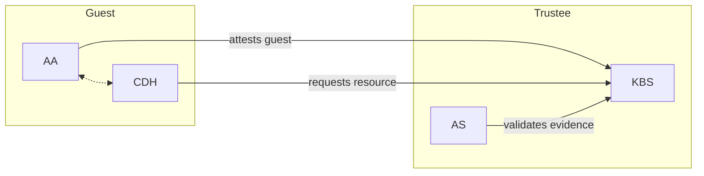
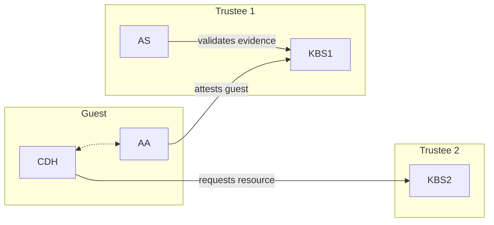

# Key Broker Service

The Confidential Containers Key Broker Service (KBS) facilitates remote attestation-based identity authentication and authorization, secret resource storage and access control.
The KBS is an implementation of a [Relying Party](https://www.ietf.org/archive/id/draft-ietf-rats-architecture-22.html).
The KBS itself does not validate attestation evidence. Instead, it supports different external components to verify TEE evidence in the form of plug-ins, including
- [CoCo Attestation-Service (CoCo AS)](../attestation-service/) ([All plugins](../attestation-service/README.md#attestation-service) supported)
- [Intel Trust Authority (ITA)](src/attestation/intel_trust_authority/) (Only supports SGX/TDX)

# Quick Start

We provide a [quick start](./quickstart.md) guide to deploy KBS locally and conduct configuration and testing on Ubuntu 22.04.

## Typical Deployments

The KBS can be deployed in several different environments, including as part of a docker compose cluster, part of a Kubernetes cluster
or without any containerization. Additionally, the KBS can interact with other attestation components in different ways.
This section focuses on the different ways the KBS can interact with other components.

### Background Check Mode

Background check mode is the most common way to configure the KBS and AS.
The term [Background Check](https://www.ietf.org/archive/id/draft-ietf-rats-architecture-22.html#section-5.2) is from the RATS architecture.
In background check mode, the KBS releases secrets to a confidential guest after the attestation agent has validated the hardware evidence.


In background check mode, the KBS is the relying party and the AS is the verifier.

Usages and examples for background check mode can be found [here](./quickstart.md#background-check-mode).

### Passport Mode

Passport mode decouples the provisioning of resources from the validation of evidence.
In background check mode these tasks are already handled by separate components,
but in passport mode they are decoupled even more.
The term [Passport](https://www.ietf.org/archive/id/draft-ietf-rats-architecture-22.html#section-5.1) is from the RATS architecture.

In passport mode, there are two KBSes, one that uses a KBS to verify the evidence and a second to provision resources.



In the RATS passport model the client typically connects directly to the verifier to get an attestation token (a passport).
In CoCo we do not support direct conections to the AS, so KBS1 serves as an intermediary.
Together KBS1 and the AS represent the verifier.
KBS2 is the relying party.

Passport mode is good for use cases when resource provisioning and attestation are handled by separate entities.

Usages and examples for background check mode can be found [here](./quickstart.md#passport-mode).

# Advanced Topics

## Build KBS Manually

If you do not want to use the community version of KBS ([built-in-as](https://github.com/confidential-containers/trustee/pkgs/container/staged-images%2Fkbs), [grpc-coco-as](https://github.com/confidential-containers/trustee/pkgs/container/staged-images%2Fkbs-grpc-as)), you can choose to build it from the source code.

### Docker image

Build the KBS container (background check mode with native AS) image:

```shell
DOCKER_BUILDKIT=1 docker build -t kbs:coco-as . -f docker/Dockerfile
```

### Binary

The Makefile supports a number of other configuration parameters.

For example,
```shell
make background-check-kbs [AS_TYPES=?] [COCO_AS_INTEGRATION_TYPE=?] [ALIYUN=?]
```

The parameters
- `AS_TYPES`: The KBS supports multiple backend attestation services. `AS_TYPES` selects which verifier to use. The options are `coco-as` and `intel-trust-authority-as`.
- `COCO_AS_INTEGRATION_TYPE`:  The KBS can connect to the CoCo AS in multiple ways. `COCO_AS_INTEGRATION_TYPE` can be set either to `grpc` or `builtin`. With `grpc` the KBS will make a remote connection to the AS. If you are manually building and configuring the components, you'll need to set them up so that this connection can be established. Similar to passport mode, the remote AS can be useful if secret provisioning and attestation verification are not in the same scope. With `builtin` the KBA uses the AS as a crate. This is recommended if you want to avoid the complexity of a remote connection.
- `ALIYUN`: The kbs support aliyun KMS as secret storage backend. `true` to enable building this feature. By default it is `false`.
## HTTPS Support

The KBS can use HTTPS. This is facilitated by openssl crypto backend.

If you want a self-signed cert for test cases, please refer to [the document](docs/self-signed-https.md).

## Storage Backend

The KBS can use different backend storage. `LocalFs` will always be builtin.
`ALIYUN` determines whether aliyun kms support will be built. The options
are `true` or `false` (by defult). Please refer to [the document](docs/config.md#repository-configuration)
for more details.

## References

### Attestation Protocol
The KBS implements and supports a simple, vendor and hardware-agnostic
[implementation protocol](./docs/kbs_attestation_protocol.md) to perform attestation.

### API
KBS implements an HTTP-based, [OpenAPI 3.1](https://spec.openapis.org/oas/v3.1.0) compliant API.
This API is formally described in its [OpenAPI formatted specification](./docs/kbs.yaml).

### Resource Repository
The [resource repository](./docs/resource_repository.md) where KBS store resource data.

### Config
A custom, [JSON-formatted configuration file](./docs/config.md) can be provided to configure KBS.

## Related Tools

### KBS Client
We provide a [KBS client](../tools/kbs-client//README.md) rust SDK and binary cmdline tool.
