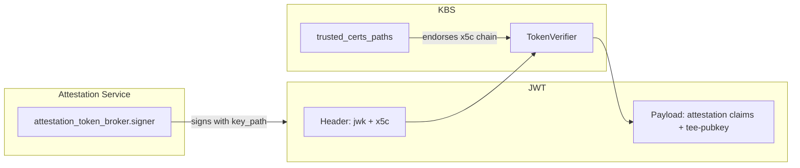

# Attestation Token Verification

After a successful RCAR attestation handshake, the Attestation Service (AS) issues
an attestation result token (a JWT). KBS uses this token to authorize resource
requests and to extract the TEE public key for JWE encryption of secret payloads.

This document explains **when** KBS verifies tokens, **how** trust anchors are
configured, and how AS signing material relates to KBS verification settings.

For the RCAR protocol flow, see [KBS Attestation Protocol](./kbs_attestation_protocol.md).
For the `[attestation_token]` configuration reference, see
[config.md](./config.md#attestation-token-configuration).
For token claim structure, see
[Attestation Token](../../attestation-service/docs/attestation_token.md).

## When KBS Verifies Tokens

KBS can authenticate resource requests in two ways:

| Method | Request header | Token verification |
|--------|----------------|-------------------|
| **Session cookie** | `Cookie: kbs-session-id=...` | KBS looks up the attestation session and reuses the token stored at `/kbs/v0/attest` (the JWT is still verified on each request). |
| **Bearer token** | `Authorization: Bearer <JWT>` | Full JWT verification via `[attestation_token]` trust anchors. |

The cookie path is used by the `kbs-client` tool, while CoCo typically uses the bearer-token path.

The **Bearer** path is used when:

- A relying party (including a separate KBS in [passport mode](../quickstart.md#passport-mode))
  receives a token out-of-band and must independently verify it.
- A client sends `Authorization: Bearer` instead of (or before) a valid session cookie.

In both paths, KBS evaluates the resource policy against token claims and, for
encrypted responses, extracts the TEE public key from the JWT body.

## Trust Chain Overview

For CoCo AS tokens, verification is a two-step process:

1. **Signature check** — KBS finds the signing key from the JWT header and verifies
   the JWT signature.
2. **Key endorsement** (when `insecure_header_jwk = false`) — KBS checks that the
   header `jwk` is backed by an `x5c` certificate chain that chains to a root in
   `trusted_certs_paths`.



On the **AS side**, configure signing material under
`attestation_token_broker.signer` (built-in CoCo AS) or the equivalent section in
the standalone AS config:

```toml
[attestation_service.attestation_token_broker.signer]
key_path = "/path/to/token.key"
cert_path = "/path/to/token-cert-chain.pem"
```

The `cert_path` PEM chain is embedded in the JWT header as `jwk.x5c`. The root CA
certificate from that chain must be listed in KBS `trusted_certs_paths`.

On the **KBS side**:

```toml
[attestation_token]
trusted_certs_paths = ["/path/to/ca-cert.pem"]
insecure_header_jwk = false
```

If `signer` is omitted, AS generates an ephemeral key pair. Tokens from such a
deployment can only be verified when `insecure_header_jwk = true` (testing only).

## Verification Paths by JWT Header

KBS selects the signing key based on what the JWT header contains.

### Header `jwk`

CoCo AS tokens follow this way. It embeds the signing public key in the JWT header, often with an `x5c`
certificate chain.

When `insecure_header_jwk = false` (recommended for production):

- The header `jwk` must include a non-empty `x5c` chain.
- The leaf certificate must match the `jwk` public key.
- The chain must validate against a certificate in `trusted_certs_paths`.
- If `trusted_certs_paths` is empty, verification fails.

When `insecure_header_jwk = true` (testing only):

- KBS uses the header `jwk` directly without checking `x5c` or `trusted_certs_paths`.
- The JWT signature is still verified, but an attacker who can replace the header
  `jwk` can make KBS accept tokens signed with an arbitrary key.

### Header `kid`

Intel TA tokens identify the signing key with a `kid` in the header. KBS looks up
the key from `trusted_jwk_sets`:

```toml
[attestation_token]
trusted_jwk_sets = ["https://portal.trustauthority.intel.com"]
```

This path is **not** affected by `insecure_header_jwk`. When using Intel TA as the
attestation backend, also configure `certs_file` under `[attestation_service]` —
that setting is used during the RCAR attestation step, not for KBS
`[attestation_token]` verification.

## TEE Public Key Extraction

After the JWT signature is verified, KBS extracts the guest TEE public key from
the token body to wrap the resource encryption key (JWE). Built-in claim paths
are tried automatically:

| Token type | Default claim path |
|------------|-------------------|
| CoCo AS (legacy) | `/customized_claims/runtime_data/tee-pubkey` |
| Intel TA | `/tdx/attester_runtime_data/tee-pubkey` |
| Intel TA (vTPM) | `/tdx/attester_user_data/tee-pubkey` |
| EAR | `/submods/cpu0/ear.veraison.annotated-evidence/runtime_data_claims/tee-pubkey` |
| Generic | `/tee-pubkey` |

Add custom paths with `extra_teekey_paths` if your token stores the key elsewhere.

## Deployment Examples

### Docker Compose Cluster

The `setup` service under `kbs/config/docker-compose/` generates a local trust
chain:

| File | Role |
|------|------|
| `ca.key` / `ca-cert.pem` | Root CA for token signing |
| `token.key` | AS token signing private key |
| `token-cert.pem` | Leaf certificate for the signing key |
| `token-cert-chain.pem` | Leaf + root chain (used by AS `signer.cert_path`) |

AS is configured with:

```json
"signer": {
    "key_path": "/opt/confidential-containers/kbs/user-keys/token.key",
    "cert_path": "/opt/confidential-containers/kbs/user-keys/token-cert-chain.pem"
}
```

KBS is configured with:

```toml
[attestation_token]
trusted_certs_paths = ["/opt/confidential-containers/kbs/user-keys/ca-cert.pem"]
```

See [KBS Cluster](./cluster.md) for the full docker-compose workflow.

### Built-in CoCo AS (local development)

Sample configs under `kbs/config/` often set `insecure_header_jwk = true` because
no stable signing certificate is configured. This is acceptable for local testing
only.

For a persistent trust chain with built-in AS, configure both sides:

```toml
[attestation_token]
trusted_certs_paths = ["./work/ca-cert.pem"]
insecure_header_jwk = false

[attestation_service]
type = "coco_as_builtin"

[attestation_service.attestation_token_broker.signer]
key_path = "./work/token.key"
cert_path = "./work/token-cert-chain.pem"
```

### Passport Mode

In passport mode, one KBS (with AS) issues tokens and a second KBS provisions
resources. The resource KBS must trust the token issuer:

```toml
[attestation_token]
trusted_certs_paths = ["./work/ca-cert.pem"]
insecure_header_jwk = false
```

See [quickstart.md](../quickstart.md#passport-mode) for a step-by-step example.

### Intel Trust Authority

```toml
[attestation_token]
trusted_jwk_sets = ["https://portal.trustauthority.intel.com"]

[attestation_service]
type = "intel_ta"
base_url = "https://api.trustauthority.intel.com"
api_key = "<API key>"
certs_file = "https://portal.trustauthority.intel.com"
```

## Security Notes

- Keep `insecure_header_jwk = false` in production whenever tokens carry a header `jwk`.
- `trusted_certs_paths` should contain only CAs you operate or explicitly trust.
- Rotating the AS signing key requires updating `signer` on the AS side and
  ensuring the new root or intermediate is in KBS `trusted_certs_paths`.
- Cookie-based sessions avoid transmitting the JWT on every request, but still rely on session
  storage integrity and expiry (and KBS still verifies the JWT before use); Bearer verification is
  required when tokens are presented directly to KBS or to external relying parties.
