# KBS Cluster

KBS provides a simple cluster defined by `docker-compose`, include itself, [Attestation Service](https://github.com/confidential-containers/trustee/tree/main/attestation-service), [Reference Value Provider Service](https://github.com/confidential-containers/trustee/tree/main/attestation-service/rvps) and [CoCo Keyprovider](https://github.com/confidential-containers/guest-components/tree/main/attestation-agent/coco_keyprovider)

Users can use very simple command to:
- launch KBS service.
- encrypt images.

## Architecture

<div align=center>



</div>

## Start-Up

Generate a user auth key pair
```
cd $KBS
openssl genpkey -algorithm ed25519 > kbs/config/private.key
openssl pkey -in kbs/config/private.key -pubout -out kbs/config/public.pub
```

Run the cluster
```bash
docker-compose up -d
```

Note that by default the KBS cluster blocks sample evidence.
If you are testing with sample evidence you will need to
set a more permissive resource policy.

Then the kbs cluster is launched.

Use `skopeo` to encrypt an image
```bash
# edit ocicrypt.conf
tee > ocicrypt.conf <<EOF
{
    "key-providers": {
        "attestation-agent": {
            "grpc": "127.0.0.1:50000"
        }
    }
}
EOF

# encrypt the image
OCICRYPT_KEYPROVIDER_CONFIG=ocicrypt.conf skopeo copy --insecure-policy --encryption-key provider:attestation-agent docker://busybox oci:busybox_encrypted
```

The image will be encrypted, and things happens in the background include:
- `CoCo Keyprovider` generates a random KEK and a key id. Then encrypts the image using the KEK.
- `CoCo Keyprovider` registers the KEK with key id into KBS.

If use the same KBS for key brokering, the image can be decrypted.
