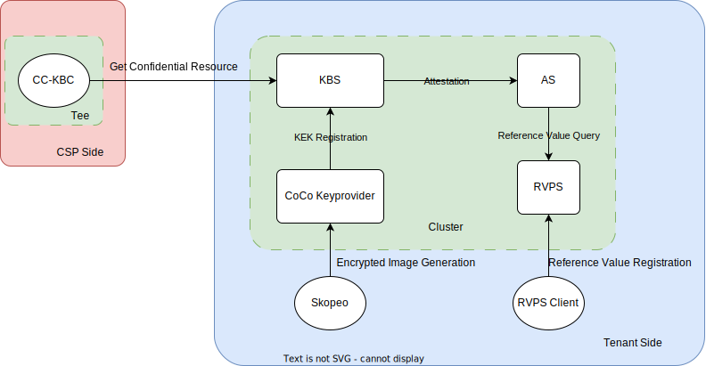

# KBS Cluster

KBS provides a simple cluster defined by `docker-compose`, include itself, [Attestation Service](../../attestation-service/), [Reference Value Provider Service](../../rvps/) and [CoCo Keyprovider](https://github.com/confidential-containers/guest-components/tree/main/attestation-agent/coco_keyprovider)

Users can use very simple command to:
- launch KBS service.
- encrypt images.

## Architecture

<div align=center>



</div>

## Start-Up

Run the cluster
```bash
git clone https://github.com/confidential-containers/trustee.git
cd trustee
docker compose up -d
```

The `setup` container initializes files under `kbs/config/docker-compose/` automatically:

- `private.key` / `public.pub`: admin JWT signer and verifier keys for KBS admin API.
- `admin-token`: long-lived admin bearer token for local development.
- `ca-cert.pem`, `token.key`, `token-cert-chain.pem` and related files:
  attestation token signing and trust chain material used by AS and KBS.

Use the generated admin token with `kbs-client`:

```bash
kbs-client config \
  --url http://127.0.0.1:8080 \
  --admin-token-file kbs/config/docker-compose/admin-token \
  set-resource-policy --allow-all
```

If `--admin-token-file` is omitted, `kbs-client` tries `~/.trustee/admin-token`,
then falls back to anonymous access (which only succeeds in `InsecureAllowAll` mode).

Note that by default the KBS cluster blocks sample evidence.
If you are testing with sample evidence you will need to
set a more permissive resource policy.

Then the kbs cluster is launched.

Use `skopeo` to encrypt an image
```bash
# edit ocicrypt.conf
tee > ocicrypt.conf <<EOF
{
    "key-providers": {
        "attestation-agent": {
            "grpc": "127.0.0.1:50000"
        }
    }
}
EOF

# encrypt the image
OCICRYPT_KEYPROVIDER_CONFIG=ocicrypt.conf skopeo copy --insecure-policy --encryption-key provider:attestation-agent docker://busybox oci:busybox_encrypted
```

The image will be encrypted, and things happens in the background include:
- `CoCo Keyprovider` generates a random KEK and a key id. Then encrypts the image using the KEK.
- `CoCo Keyprovider` registers the KEK with key id into KBS.

If use the same KBS for key brokering, the image can be decrypted.
