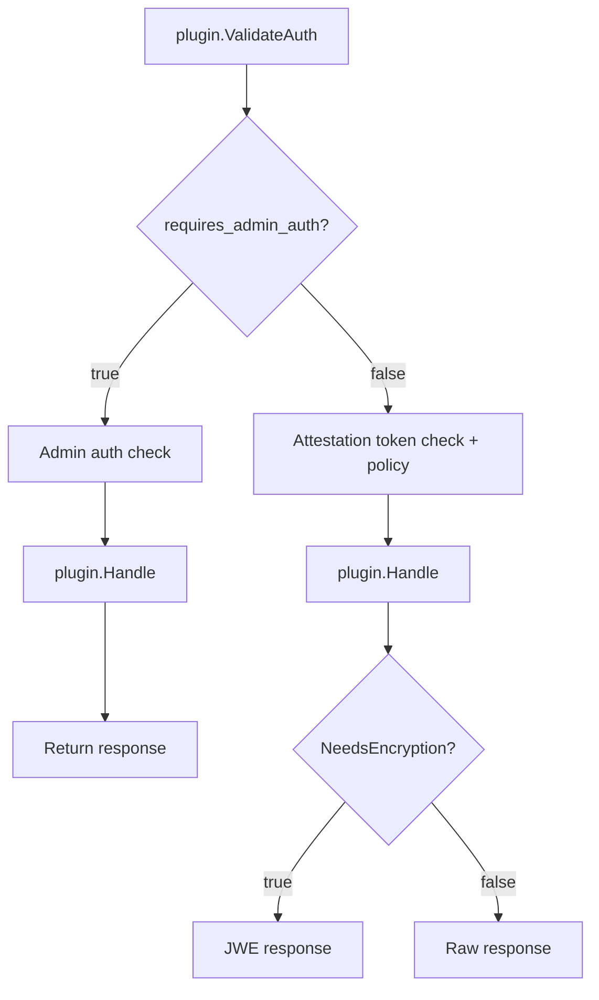

# External Plugins

KBS external plugins are standalone gRPC services that extend KBS with custom
endpoints. When a client sends a request to
`/kbs/v0/external/<plugin-name>/...`, KBS forwards it to the corresponding
plugin over gRPC and returns the plugin's response to the client.

This lets you add new capabilities — secret injection, policy evaluation,
certificate issuance, custom key management — without modifying the KBS
codebase. Each plugin runs as an independent process or container,
communicating with KBS via the `kbs.plugin.v1.KbsPlugin` gRPC service defined
in [`protos/plugin.proto`](../../protos/plugin.proto).

Multiple plugins are registered as backends under a single `external` plugin
entry in the KBS config. KBS routes requests to the right backend based on the
first path segment after `/kbs/v0/external/`.

### Architecture: stub vs. real plugin

There are two distinct layers:

- **In-tree stub plugin** — `external_plugin` is an in-tree KBS plugin (enabled
  with `--features external-plugin`) and acts a routing stub only. It handles
  auth, attestation, and JWE, then forwards requests over gRPC to whichever
  backend the URL names.

- **Out-of-tree plugins** — the actual plugin implementations are separate
  processes or containers that live **outside the Trustee repository**. You
  write and maintain them; KBS talks to them over the `KbsPlugin`gRPC
  interface. Nothing in core Trustee knows or cares about their internals.
  Trustee brokers the REST requests to the configured plugin but each plugin is
  responsible for their API versioning/backwards compatibility. Bugs should
  also be reported to the respective plugin repositories.


For KBS configuration see [`config.md`](config.md#external-plugin-configuration).

---

## Authentication Model

KBS gates every plugin request through one of two authentication paths. Before
forwarding a request, KBS calls the plugin's `ValidateAuth` RPC to ask which
path to use:



- **`requires_admin_auth = true`** — KBS checks admin credentials before
  forwarding. Use this for provisioning endpoints where the caller is an
  operator, not a TEE workload.

- **`requires_admin_auth = false`** — KBS requires a valid attestation token
  and evaluates the configured resource policy. This is the standard path for
  TEE workloads retrieving secrets.

- **`NeedsEncryption`** — after `Handle` returns, KBS asks whether the
  response should be JWE-encrypted with the TEE's ephemeral public key.
  Return `true` for any response containing secret material. JWE ensures only
  the TEE that completed the RCAR handshake can decrypt the response — HTTPS
  alone is not sufficient for secrets.

  > `NeedsEncryption` is only called on the attestation-gated path. JWE
  > requires the TEE's public key from the attestation token, which is not
  > available on the admin path.

A single plugin can implement both paths: inspect `method` or `path` in
`ValidateAuth` to differentiate, e.g. `POST` (provision secret) -> admin auth,
`GET` (retrieve secret) -> attestation-gated + encryption.

---

## gRPC Protocol

The plugin implements the `kbs.plugin.v1.KbsPlugin` service from
[`protos/plugin.proto`](../../protos/plugin.proto):

1. **`Handle`** — process an HTTP request forwarded from KBS
2. **`ValidateAuth`** — decide admin auth vs. attestation-gated per request
3. **`NeedsEncryption`** — decide whether to JWE-encrypt the response

A complete working example is in
[`kbs/test/external_plugin_test_server.rs`](../test/external_plugin_test_server.rs).

### Request and Response Fields

**`PluginRequest`:**

| Field | Type | Description |
|---|---|---|
| `body` | bytes | Raw HTTP request body |
| `query` | map<string, string> | URL query parameters |
| `path` | repeated string | Path segments after the backend name. For `/kbs/v0/external/my-plugin/a/b` this is `["a", "b"]` — KBS strips the backend name `my-plugin` before forwarding |
| `method` | string | HTTP method (`GET`, `POST`, `PUT`, `DELETE`) |

**`PluginResponse`:**

| Field | Type | Description |
|---|---|---|
| `body` | bytes | Response body returned to the caller |
| `status_code` | int32 | HTTP status hint. `0` or `2xx` returns the body as-is. Non-2xx causes KBS to treat the call as a plugin error (caller receives 401) |
| `content_type` | string | Reserved for future use; currently ignored by KBS |

### Error Handling

Plugin errors (gRPC failures, non-2xx `status_code`, or unregistered backend
name) result in a `401 Unauthorized` response to the caller. Error details are
logged server-side. This follows the KBS protocol convention that plugin errors
yield 401 responses.

---

## Building and Packaging

Build your plugin as a binary and run it alongside KBS. The plugin only needs
to listen on a TCP port and implement the `KbsPlugin` gRPC service.

Test the plugin directly with grpcurl before wiring it into KBS:

```bash
grpcurl -plaintext -d '{"method":"GET","path":["test"]}' \
  127.0.0.1:50051 kbs.plugin.v1.KbsPlugin/Handle
```

---

## Deploying

### Standalone

Run the plugin and KBS as separate processes:

```bash
# Terminal 1: start plugin
./my-plugin

# Terminal 2: start KBS
cargo run --bin kbs --features external-plugin -- \
    --config-file kbs-config.toml

# Terminal 3: test
curl http://127.0.0.1:8080/kbs/v0/external/my-plugin/test
```

Using the test config from this repo:

```bash
# Terminal 2
cd kbs && cargo run --bin kbs --features external-plugin -- \
    --config-file test/config/external-plugin.toml

# Terminal 3 (port 8085 and plugin name match the test config)
curl http://127.0.0.1:8085/kbs/v0/external/echo-test/test
```

### End-to-End Tests

The `kbs/test/` Makefile includes integration tests for the full KBS-to-plugin flow:

| Target | Description |
|---|---|
| `test-ext-plugin` | Plaintext plugin on `:50051`, KBS on `:8085` |
| `test-ext-plugin-metrics` | Verify `/metrics` has plugin counters |
| `test-ext-plugin-tls` | TLS plugin on `:50052`, KBS on `:8086` |
| `test-ext-plugin-attest` | Attestation-gated access on `:8087` |
| `test-ext-resource-plugin` | Resource store roundtrip on `:8088` |
| `test-ext-resource-plugin-tls` | Resource store over TLS plugin connection on `:8089` |
| `e2e-ext-plugin` | Run all six tests with automatic cleanup |
| `stop-ext-plugins` | Stop all external plugin processes |

```bash
cd kbs/test && make e2e-ext-plugin
```

**Echo tests** (`test-ext-plugin`, `test-ext-plugin-tls`, `test-ext-plugin-attest`) verify
request forwarding: the test plugin reflects request details back as plaintext. The attestation
variant also checks that unauthenticated requests are rejected and that a valid attestation token
grants access.

**Resource roundtrip tests** (`test-ext-resource-plugin`, `test-ext-resource-plugin-tls`) exercise
the full provision-and-retrieve flow: an admin POST stores a random 16-byte secret in the plugin's
in-memory store (admin-auth gated via `InsecureAllowAll`), the client attests to obtain a token,
and a GET with that token retrieves the same bytes. A `diff` confirms the roundtrip. The TLS
variant adds TLS on the KBS->plugin gRPC connection only; the client->KBS leg stays plain HTTP in
both resource tests.

---

## Monitoring

KBS exposes per-plugin Prometheus metrics at `/metrics`:

| Metric | Type | Description |
|---|---|---|
| `kbs_plugin_requests_total{plugin_name="..."}` | Counter | Total `Handle` calls forwarded to the backend |
| `kbs_plugin_request_duration_seconds{plugin_name="..."}` | Histogram | `Handle` call latency |
| `kbs_plugin_errors_total{plugin_name="..."}` | Counter | Total gRPC errors (all RPCs) |

The `plugin_name` label is the backend name from the `backends` array (e.g. `echo-test`),
not the top-level `external` plugin name.

```bash
curl http://127.0.0.1:8080/metrics | grep kbs_plugin
```

---

## Troubleshooting

**Connection refused at startup**

```
Error: Initialize 'external' plugin failed

Caused by:
    0: Failed to initialise backend '<name>'
    1: Failed to connect to external plugin
    2: Failed to connect to plugin after retry window
    3: <tonic transport error>
```

Plugin is not running or endpoint is wrong. KBS connects to all configured
backends at startup and exits if any are unreachable. Verify the plugin is
running and the endpoint in `kbs-config.toml` matches its bind address.

**TLS errors at startup**

```
Backend 'x': TLS mode requires https:// endpoint, got http://
Backend 'x': tls mode requires ca_cert_path
```

Endpoint scheme must match `tls_mode` (`http://` for insecure, `https://` for
tls). Verify cert paths exist and are readable.

**401 on requests**

All plugin errors (gRPC failures, plugin returning non-2xx, unregistered
sub-backend name) result in 401. Check the KBS server log for the specific
error message, which is logged at ERROR level alongside the request.

**404 on requests**

```
GET /kbs/v0/external/my-plugin/test -> 404 Not Found
```

No plugin registered with the name `external`. Check `kbs-config.toml` for a
`[[plugins]]` entry with `name = "external"` and confirm KBS was built with
`--features external-plugin`.
