# Reference Value Provider Service

Reference Value Provider Service, or RVPS for short, is a component to receive software supply chain provenances/metadata, verify them, and extract the reference values.
All the reference values will be stored inside RVPS. When the Attestation Service queries specific software claims, RVPS will response with related reference values.

## Architecture

RVPS contains the following components:

- Extractors : Extractors has sub-modules to process different types of provenance. Each sub-module will consume the input Message, and then generate an output Reference Value.

- Storage : RVPS uses the `key-value-storage` crate to provide a unified key-value storage interface. All verified reference values will be stored in a storage backend. When requested by Attestation Service, related reference value will be provided. The storage backend can be configured to use different implementations such as in-memory, local file system, local JSON file, or PostgreSQL.

## Message Flow

The following figure illustrates the message flow of RVPS:



### Message

A protocol helps to distribute provenance of binaries. It will be received and processed
by RVPS, then RVPS will generate a Reference Value if working correctly. 

```
{
    "version": <VERSION-NUMBER-STRING>,
    "type": <TYPE-OF-THE-PROVENANCE-STRING>,
    "provenance": #provenance,
}
```

The `"version"` field is the version of this message, making extensibility possible.

The `"type"` field specifies the concrete type of the provenance the message carries.

The `"provenance"` field is the main content passed to RVPS. This field contains the payload to be decrypted by RVPS. 
The meaning of the provenance depends on the type and concrete Extractor which process this.

### Trust Digests

It is the reference values really requested and used by Attestation Service to compare with the gathered evidence generated from HW TEE. They are usually digests. To avoid ambiguity, they are named `trust digests` rather than `reference values`.

## Run RVPS

### Pre-requisite

Install the protocol buffer compiler package `protobuf-compiler`.

### Build Directly

In this way, the RVPS can run as a single service. The [gRPC protos](../protos/reference.proto) are defined.

We can run using the following command

```bash
git clone https://github.com/confidential-containers/trustee
cd trustee/rvps
make build && sudo make install
```

Run RVPS
```shell
rvps
```

By default RVPS listens on `localhost:50003` waiting for requests.

### Container Image

We can build an RVPS docker image

```bash
cd .. && docker build -t rvps -f rvps/docker/Dockerfile .
```

Run the container
```bash
docker run -d -p 50003:50003 rvps --address 0.0.0.0:50003
```

Or we can build RVPS as a podman image

```bash
cd .. && podman build -t rvps -f rvps/docker/Dockerfile .
```

Run
```bash
podman run -d -p 50003:50003 --net host rvps
```

### Configuration file

RVPS can be launched with a specified configuration file by `-c` flag. A configuration file looks like:

```json
{
    "storage": {
        "storage_type": "LocalFs",
        "backends": {
            "local_fs": {
                "dir_path": "/opt/confidential-containers/storage/local_fs"
            }
        }
    },
    "extractors": {
        "swid_extractor": {}
    }
}
```

#### Storage Backend Configuration

The `storage` object uses the unified storage backend configuration format.

For detailed information about the unified storage backend configuration format, including what a **namespace** is and how it works, see the [Key-Value Storage README](../deps/key-value-storage/README.md#unified-storage-backend-configuration).

#### Storage Namespace in RVPS

When RVPS runs as a standalone service, it uses a single storage namespace:

| Namespace Name | Component | Description |
|----------------|-----------|-------------|
| `reference-value` | RVPS | Stores reference values for software supply chain verification |

For detailed configuration options and examples, see the [Key-Value Storage README](../deps/key-value-storage/README.md#unified-storage-backend-configuration).

#### Extractors Configuration

RVPS uses extractors to process different types of provenance and extract reference values. The `extractors` configuration is optional and allows you to configure specific extractor behaviors.

| Property | Type | Description | Required | Default |
|----------|------|-------------|----------|---------|
| `swid_extractor` | Object | Configuration for SWID/RIM extractor | No | None (uses default) |

**Available Extractors:**

RVPS supports the following extractors (enabled by default):

1. **Sample Extractor** (`sample`): A simple extractor for testing and demos. It directly extracts reference values from input without verifying signatures. See [Sample Extractor README](src/extractors/sample/README.md) for details.

2. **SWID/RIM Extractor** (`swid`): Extracts reference values from SWID tags with RIM (Reference Integrity Manifest) bindings. Currently tested with NVIDIA RIM manifests for GPU vbios. See [SWID RIM Extractor README](src/extractors/swid/README.md) for details.
   - Currently, `swid_extractor` has no configuration options (empty object `{}`)
   - The extractor does not verify manifest signatures; authenticity should be verified before providing to RVPS
   - Default expiration time: 12 months
   - Default hash algorithm: `sha384`

3. **In-toto Extractor** (`in-toto`): Verifies and extracts reference values from in-toto provenance metadata. Requires the `in-toto` feature flag. See [In-toto Extractor README](src/extractors/in_toto/README.md) for details.

**Example Configuration:**

```json
{
    "storage": {
        "storage_type": "LocalFs",
        "backends": {
            "local_fs": {
                "dir_path": "/opt/confidential-containers/storage/local_fs"
            }
        }
    },
    "extractors": {
        "swid_extractor": {}
    }
}
```

**Note:** If `extractors` is not specified, RVPS will use default configurations for all extractors. The sample extractor is always enabled, and SWID extractor will use default settings if not explicitly configured.

#### Configuration Examples

Using LocalFs storage:

```json
{
    "storage": {
        "storage_type": "LocalFs",
        "backends": {
            "local_fs": {
                "dir_path": "/opt/confidential-containers/storage/local_fs"
            }
        }
    }
}
```

Using LocalJson storage:

```json
{
    "storage": {
        "storage_type": "LocalJson",
        "backends": {
            "local_json": {
                "file_dir_path": "/opt/confidential-containers/storage/local_json"
            }
        }
    }
}
```

Using PostgreSQL storage:

```json
{
    "storage": {
        "storage_type": "Postgres",
        "backends": {
            "postgres": {
                "host": "localhost",
                "port": 5432,
                "db": "rvps",
                "username": "postgres",
                "password": "password"
            }
        }
    }
}
```

Using in-memory storage (default):

```json
{
    "storage": {
        "storage_type": "Memory"
    }
}
```

## Integrate RVPS into the Attestation Service

### Native Mode (Not Recommend)

In this mode, the RVPS will work as a crate inside the Attestation Service binary.



### gRPC Mode

In this mode, the Attestation Service will connect to a remote RVPS. This requires the Attestation Service to be built with feature `rvps-grpc`.

```bash
cd ../attestation-service && cargo run --bin as-grpc -- --config-file config.json
```



## Client Tool

The `rvps-tool` tool is a command line client to interact with RVPS. It can:
- Register reference values into the RVPS
- Query reference values from the RVPS

### Quick guide to interact with RVPS

Run RVPS in docker or by issuing the following commands
```bash
RVPS_ADDR=127.0.0.1:50003
rvps --address $RVPS_ADDR
```

Create a test message in [sample format](./src/extractors/sample/README.md)
```bash
cat << EOF > sample
{
    "test-binary-1": [
        "reference-value-1",
        "reference-value-2"
    ],
    "test-binary-2": [
        "reference-value-3",
        "reference-value-4"
    ]
}
EOF
provenance=$(cat sample | base64 --wrap=0)
cat << EOF > message
{
    "version" : "0.1.0",
    "type": "sample",
    "payload": "$provenance"
}
EOF
```

Register the provenance into RVPS
```bash
rvps-tool register --path ./message --addr http://$RVPS_ADDR
```

It will say something like
```
[2023-03-09T04:44:11Z INFO  rvps_client] Register provenance succeeded.
```

Let's then query the reference values
```bash
rvps-tool query --addr http://$RVPS_ADDR
```

The output should display something like the following:
```
[2025-01-24T06:04:41Z INFO  rvps_tool] Get reference values succeeded:
     {"test-binary-1":["reference-value-1","reference-value-2"],
      "test-binary-2":["reference-value-3","reference-value-4"]}
```
